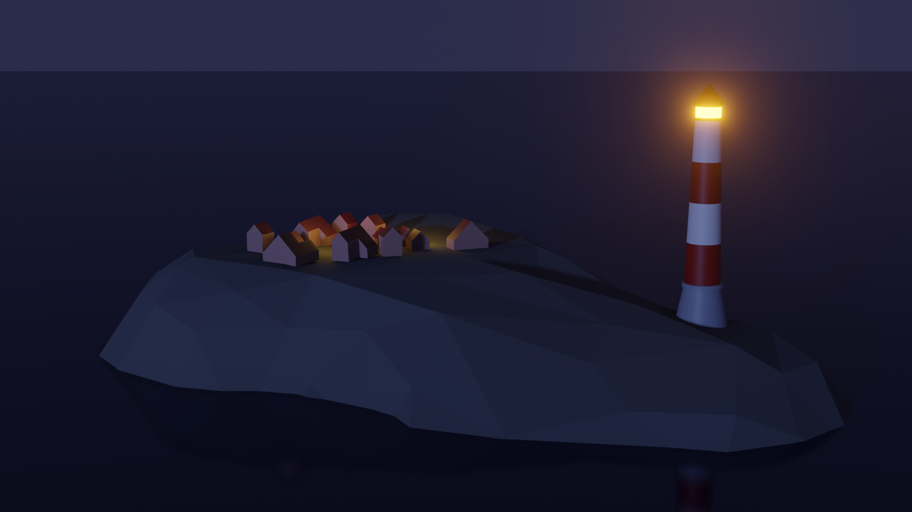
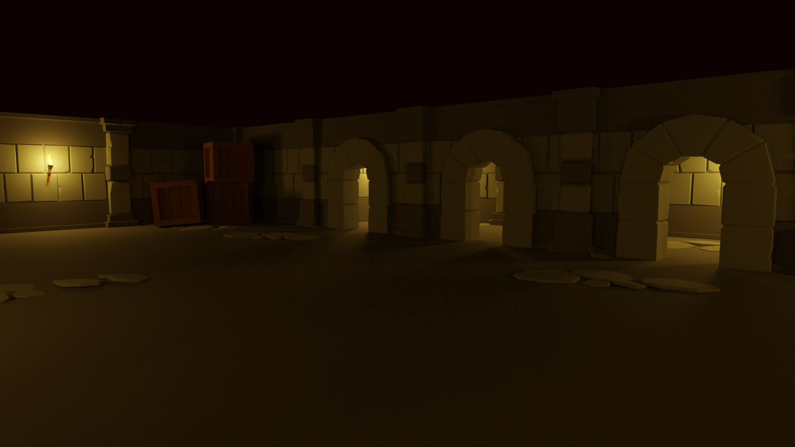
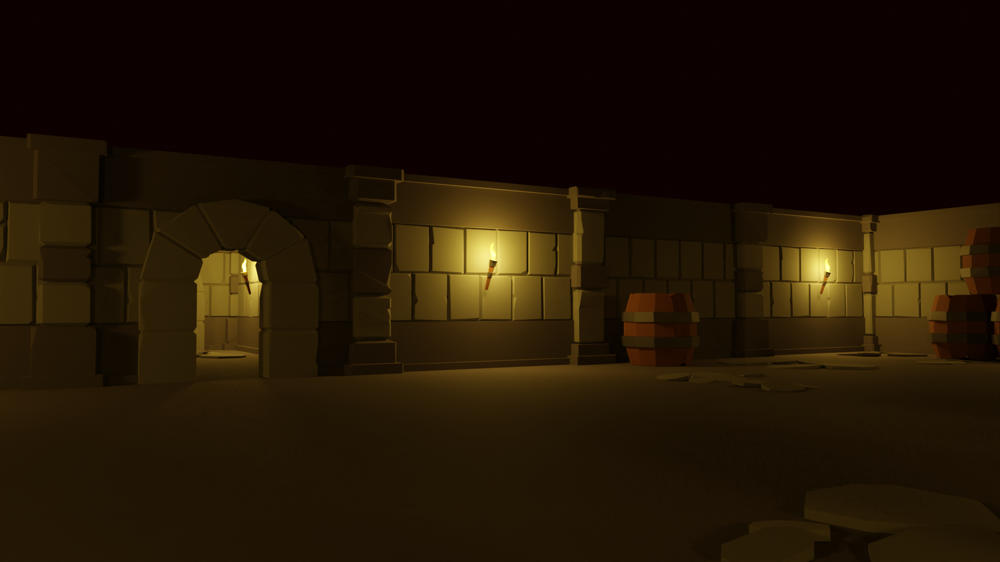
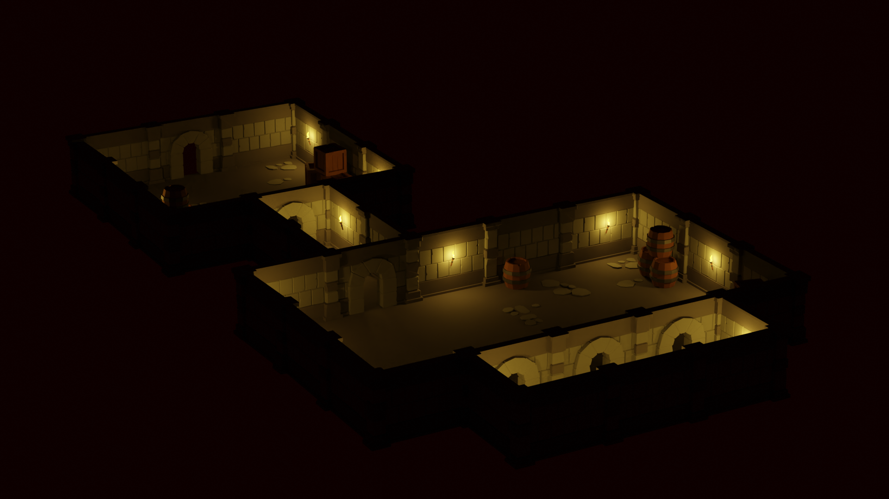
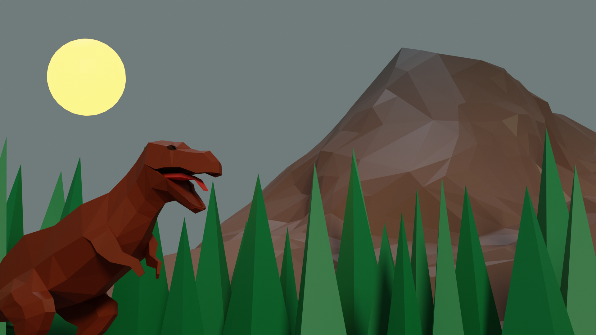

# Coursework for "Complete Blender Creator: Learn 3D Modelling for Beginners"

This repository contains the assets developed as part of the course [Complete Blender Creator: Learn 3D Modelling for Beginners](https://www.udemy.com/course/blendertutorial/).

# Section 1: Introduction and Setup

A simple section that resulted in the modelling of a lighthouse scene.

<table width="100%">
<tbody>
<tr>
<td>
<figure>

</figure>
</td>
</tr>
</tbody>
</table>

# Section 2: Modular Dungeon

This section focused on creating a "modular dungeon kit" and assembling a primitive dungeon with the kit.

<table width="100%">
<tbody>
<tr>
<td>
<figure>

</figure>
</td>
</tr>
<tr>
<td>
<figure>

</figure>
</td>
</tr>
<tr>
<td>
<figure>

</figure>
</td>
</tr>
</tbody>
</table>

# Section 3: Low Poly Dinosaur Scene

This section focused on creating a low poly dinosaur and placing them in a scene.

<table width="100%">
<tbody>
<tr>
<td>
<figure>

</figure>
</td>
</tr>
</tbody>
</table>

# Section 4: SpitFire flyby

This section focused on basics of UV mapping with a low poly plane and a city scene. A simple fly-by animation was added.

https://user-images.githubusercontent.com/11840/214720612-63dac1df-e3ec-4c21-a16b-5ec4b6f22621.mp4

# Section 5: Mr Tv-Head Walking

This section focused on basics of rigging and animation and produced a simple walk cycle for a character.

<video src="https://user-images.githubusercontent.com/11840/215051973-48d00a44-385c-4f6a-a73e-8f5de6136d67.mp4" data-canonical-src="https://user-images.githubusercontent.com/11840/215051973-48d00a44-385c-4f6a-a73e-8f5de6136d67.mp4" controls="controls" muted="muted" class="d-block rounded-bottom-2 border-top width-fit" style="max-height:640px; min-height: 200px" loop></video>

https://user-images.githubusercontent.com/11840/215051973-48d00a44-385c-4f6a-a73e-8f5de6136d67.mp4
